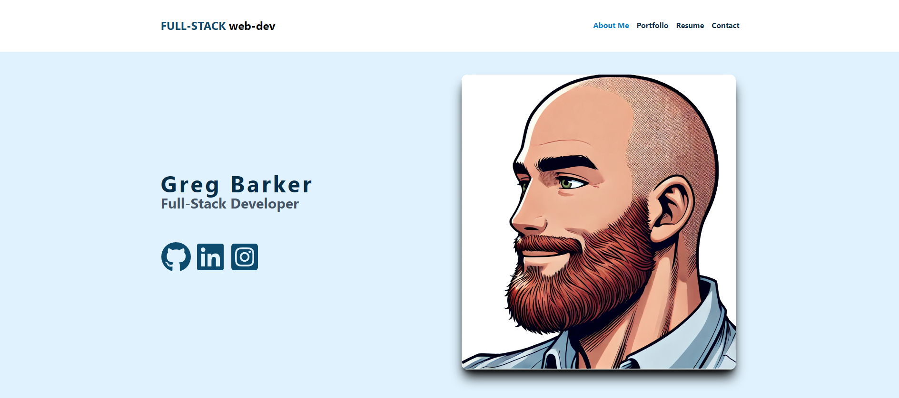

# React Portfolio


## Table of Contents

- [React Portfolio](#react-portfolio)
  - [Table of Contents](#table-of-contents)
  - [Description](#description)
  - [Installation Instructions](#installation-instructions)
  - [Usage Instructions](#usage-instructions)
  - [Contributing Guidelines](#contributing-guidelines)
  - [License Information](#license-information)
  - [Acknowledgments](#acknowledgments)
  - [Questions](#questions)
  - [Resources](#resources)

## Description

The **React Portfolio** is a personal portfolio website designed to showcase my web development projects and skills. Built with **React** and deployed using **Netlify**, this single-page application (SPA) allows employers and collaborators to view my work, contact me, and download my resume. This portfolio is optimized for performance and SEO, using the latest in front-end technology.

[Deployed Project](https://quiet-hotteok-ca264a.netlify.app/)



## Installation Instructions

To install and run this project locally:

1. Clone the repository:

   ```bash
   git clone https://github.com/savevsgames/React-Portfolio.git
   ```

2. Navigate to the project directory:

   ```bash
   cd React-Portfolio
   ```

3. Install the required dependencies:

   ```bash
   npm install
   ```

4. Start the development server:
   ```bash
   npm run dev
   ```

## Usage Instructions

To view the project:

- Visit the deployed site: [React Portfolio on Netlify](https://quiet-hotteok-ca264a.netlify.app/)

To contribute:

1. Fork the repository.
2. Create a new branch (`git checkout -b feature-branch`).
3. Make your changes.
4. Push to your fork and submit a pull request.

## Contributing Guidelines

Contributions to the **React Portfolio** project are welcome! Here’s how to get started:

1. Fork the repository.
2. Create a new branch for your feature or bug fix.
3. Make your changes and commit them with clear, descriptive messages.
4. Push your changes to your fork.
5. Submit a pull request with a detailed description of your changes.

## License Information

This repository is covered under the **MIT License**. See the [LICENSE](./LICENSE) file for more details.

## Acknowledgments

- **React**: For providing an intuitive framework to build modern web applications.
- **Vite**: For streamlining the development process with fast and efficient build tools.
- **Netlify**: For offering a seamless deployment process for web applications.
- **Open Source Community**: For fostering collaboration and innovation.

## Questions

If you have any questions or need further support, feel free to contact me:

- GitHub: [savevsgames](https://github.com/savevsgames)
- Email: [gregcbarker@gmail.com](mailto:gregcbarker@gmail.com)

For issues or feature requests, please create an issue in the repository.

## Resources

- [React Documentation](https://reactjs.org/)
- [Vite Documentation](https://vitejs.dev/)
- [Netlify Documentation](https://www.netlify.com/docs/)
- [Markdown Guide](https://www.markdownguide.org/)
- [Choose a License](https://choosealicense.com/)
